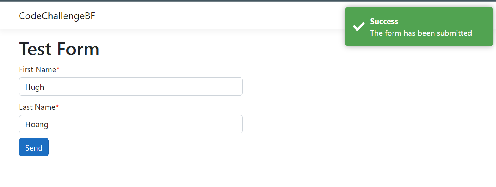

# How to run

- Open the `CodeChallengeBF.sln` with Visual Studio 2022
- Retore the NuGet packages
- Run the solution, wait for the `ng serve` to finish
- Browse to `http://localhost:44418`

# Dev proxy

- By default the API is running on `http://localhost:5001`.
  - To change it, set the `ASPNETCORE_URLS` environment variable. For example `ASPNETCORE_URLS='http://localhost:9001'`
  - Restart everything and the API should be running on the new URL, as well as the Angular proxy server

# Screenshot

